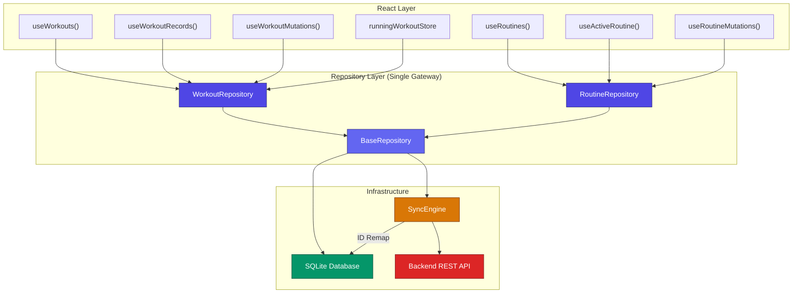
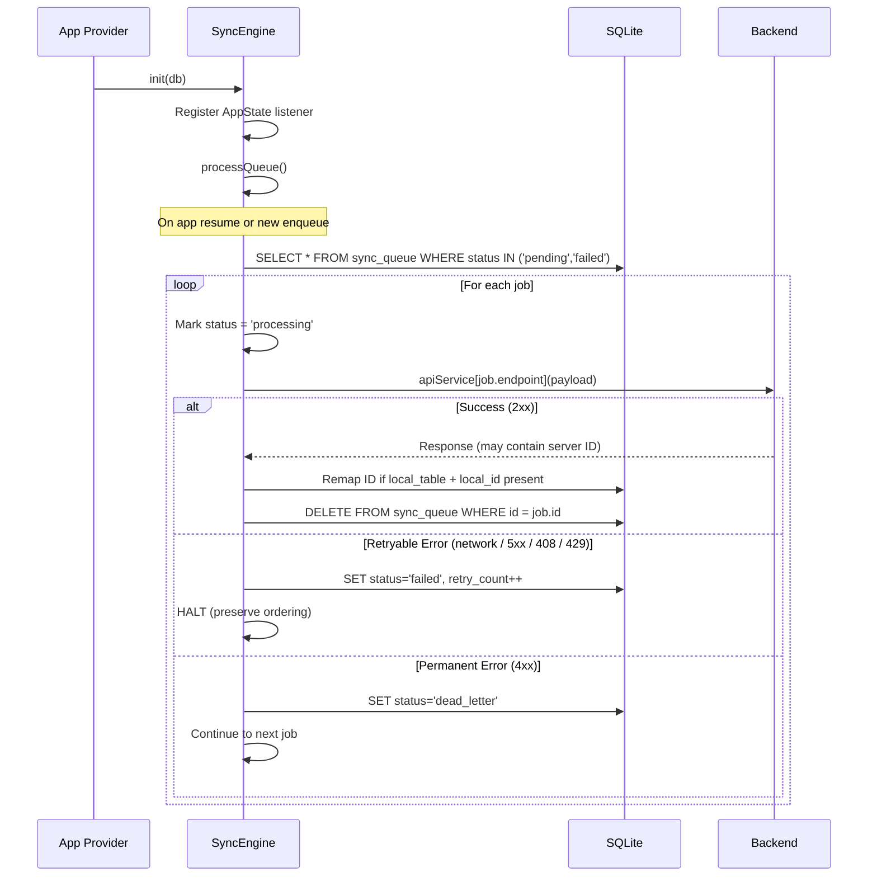
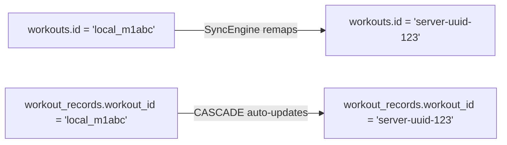
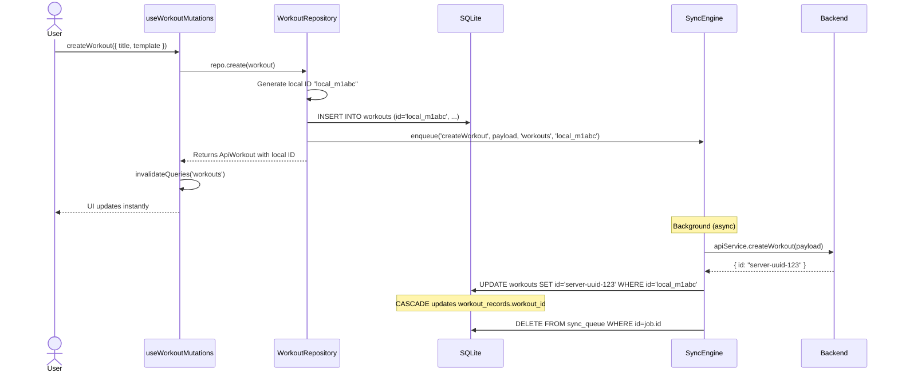
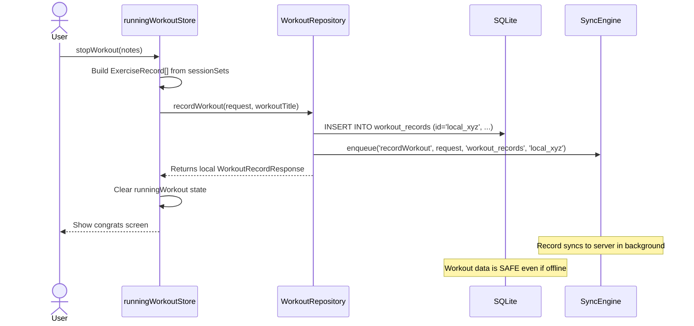
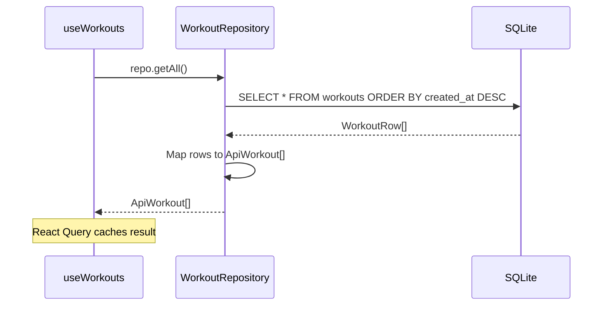
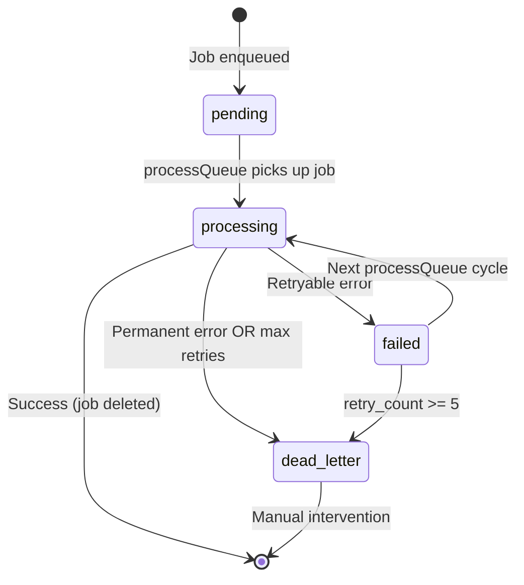

# Active Next — Local-First Sync Architecture

Comprehensive documentation for the **Repository-Based Local-First Sync Engine** powering Active Next.

---

## Core Philosophy

**The local SQLite database is the single source of truth for the UI.** Every screen reads data from SQLite. Every mutation writes to SQLite first, then enqueues a background job to replicate the change to the server. The user never waits for a network round-trip.

```
User Action → SQLite Write → UI Updates Instantly → Background Sync to Server
```

This guarantees:

- **Instant UI** — mutations are reflected in < 1ms (local disk I/O)
- **Offline resilience** — the app works fully without connectivity
- **Data safety** — completed workouts are never lost, even if the server is unreachable

---

## Architecture Overview



### Key Rule

> **No hook, store, or component ever touches SQLite or the API directly.**
> All data access flows through Repository classes.

---

## Layer-by-Layer Breakdown

### Layer 1 — Database (`lib/db/`)

#### `connection.ts` — Singleton Connection

Every consumer in the app shares a **single** SQLite database handle. This solves a critical problem: if multiple handles exist, `PRAGMA foreign_keys = ON` may not be active on all of them, causing cascade operations to silently fail.

```typescript
import { getDatabase } from '../lib/db/connection'

const db = await getDatabase() // Always returns the same handle
```

The singleton guarantees:
- `PRAGMA journal_mode = WAL` — write-ahead logging for concurrent read performance
- `PRAGMA foreign_keys = ON` — required for `ON UPDATE CASCADE` ID remapping

#### `migrations.ts` — Schema Management

Uses SQLite's `PRAGMA user_version` for versioned migrations. Current schema (v1):

| Table | Purpose | Key Columns |
|-------|---------|-------------|
| `sync_queue` | Pending sync jobs | `endpoint`, `payload`, `local_table`, `local_id`, `idempotency_key`, `status` |
| `workouts` | Workout definitions | `id`, `title`, `workout_template` (JSON), `is_synced` |
| `workout_records` | Completed workout history | `id`, `workout_id` (FK → workouts), `exercise_records` (JSON), `is_synced` |
| `routines` | Training routines | `id`, `name`, `pattern` (JSON), `is_active`, `is_synced` |

**Foreign Key Cascade**: `workout_records.workout_id` references `workouts.id` with `ON UPDATE CASCADE`. When the SyncEngine remaps a workout's temporary ID to its server ID, all associated records update automatically.

---

### Layer 2 — Repositories (`lib/repositories/`)

Repositories are the **single gateway** for all data access. They encapsulate:
- SQL queries (reads)
- SQL writes + sync queue insertion (mutations)
- Server data hydration (UPSERT)
- Row-to-type mapping

#### `BaseRepository.ts` — Abstract Base

Provides shared utilities inherited by all repositories:

```typescript
abstract class BaseRepository {
  protected db: SQLiteDatabase

  // Collision-safe temporary IDs: "local_m1abc_x7k2p9"
  protected generateLocalId(): string

  // Queue a background sync job
  protected async enqueueSync(config: SyncJobConfig): Promise<void>

  // SQL helpers
  protected async queryAll<T>(sql: string, ...params: any[]): Promise<T[]>
  protected async queryFirst<T>(sql: string, ...params: any[]): Promise<T | null>
  protected async run(sql: string, ...params: any[]): Promise<void>
}
```

#### `WorkoutRepository.ts`

Handles all workout and workout record data:

| Method | What It Does |
|--------|-------------|
| `getAll()` | `SELECT * FROM workouts` — returns `ApiWorkout[]` |
| `getById(id)` | Single workout lookup |
| `create(req)` | Insert into SQLite + enqueue `createWorkout` sync job |
| `update(id, changes)` | Update SQLite + enqueue `updateWorkout` sync job |
| `delete(id)` | Delete from SQLite + enqueue `deleteWorkout` sync job |
| `getAllRecords()` | `SELECT * FROM workout_records` — returns `WorkoutRecord[]` |
| `recordWorkout(req, title)` | Insert record into SQLite + enqueue `recordWorkout` sync job |
| `deleteRecord(id)` | Delete record + enqueue `deleteWorkoutRecord` sync job |
| `hydrateWorkouts(data)` | UPSERT server data into local SQLite |
| `hydrateRecords(data)` | UPSERT server records into local SQLite |

#### `RoutineRepository.ts`

Handles all routine data:

| Method | What It Does |
|--------|-------------|
| `getAll()` | `SELECT * FROM routines` — returns `Routine[]` |
| `getById(id)` | Single routine lookup |
| `getActive()` | `SELECT ... WHERE is_active = 1` — returns active routine or null |
| `create(payload)` | Insert into SQLite + enqueue `createRoutine` sync job |
| `update(id, changes)` | Update SQLite + enqueue `updateRoutine` sync job |
| `delete(id)` | Delete from SQLite + enqueue `deleteRoutine` sync job |
| `hydrateFromServer(data)` | UPSERT server routines into local SQLite |

---

### Layer 3 — SyncEngine (`lib/sync/SyncEngine.ts`)

The SyncEngine is a background worker that drains the `sync_queue` table sequentially, executing each job against the backend REST API.

#### Lifecycle



#### Key Features

| Feature | Detail |
|---------|--------|
| **Single DB handle** | Uses the shared `getDatabase()` singleton — PRAGMAs guaranteed |
| **Explicit init** | Called once from `Provider.tsx` on mount; registers AppState listener immediately |
| **Table allowlist** | Only `workouts`, `workout_records`, `routines` accepted in `local_table` — prevents SQL injection |
| **Error categorization** | 4xx (except 408/429) → dead letter immediately; network/5xx → retry with ordering preserved |
| **Max retries** | 5 attempts before dead-lettering |
| **Idempotency keys** | Each job gets a unique key for future server-side deduplication |
| **Event emitter** | Emits `sync:start`, `sync:complete`, `sync:error`, `sync:idle` for UI status indicators |
| **Queue ordering** | Jobs process in `created_at ASC` order; halts on first retryable failure to prevent out-of-order execution |

#### ID Remapping

When the server responds with a real UUID after a create operation:

1. SyncEngine updates the local table: `UPDATE workouts SET id = 'server-uuid' WHERE id = 'local_m1abc_x7k2p9'`
2. SQLite's `ON UPDATE CASCADE` automatically propagates the ID change to `workout_records.workout_id`
3. The record is marked `is_synced = 1`



---

### Layer 4 — React Integration

#### `lib/hooks/useRepository.ts`

Provides memoized repository instances bound to the current SQLite context:

```typescript
import { useWorkoutRepository } from '../../../lib/hooks/useRepository'
import { useRoutineRepository } from '../../../lib/hooks/useRepository'

function MyComponent() {
  const workoutRepo = useWorkoutRepository()
  const routineRepo = useRoutineRepository()
}
```

#### Provider Bootstrap (`app/Provider.tsx`)

On mount, the `SyncEngineBootstrap` component:
1. Initializes the SyncEngine with the shared DB handle
2. Drains any queued jobs from previous sessions
3. Runs a non-blocking server hydration to pull fresh data

```typescript
function SyncEngineBootstrap({ children }) {
  const db = useSQLiteContext()

  useEffect(() => {
    syncEngine.init(db)           // 1. Start sync engine
    hydrateFromServer(db)          // 2. Pull server data (best-effort)
    return () => syncEngine.destroy()
  }, [db])

  return <>{children}</>
}
```

#### Server Hydration

On every app launch (while online), the Provider fetches:
- All workouts (`GET /workouts`)
- All workout records (`GET /workout-records`)
- All routines (`GET /routines`)
- Active routine ID from user profile

Each response is **UPSERT**-ed into SQLite using `INSERT ... ON CONFLICT(id) DO UPDATE`. This ensures the local database reflects the latest server state without overwriting unsynced local changes (unsynced rows have different IDs that won't conflict).

---

## Data Flow Examples

### Creating a Workout (Online or Offline)



### Finishing a Workout Session



### Reading Workouts (Always Local)



No network call. No loading spinner. Instant.

---

## Developer Guide

### Adding a New Entity

To add a new entity (e.g., `MealPlan`) to the local-first system:

#### 1. Add the SQLite table

In `lib/db/migrations.ts`, increment `DATABASE_VERSION` and add a new migration block:

```typescript
if (currentDbVersion < 2) {
  await db.execAsync(`
    CREATE TABLE IF NOT EXISTS meal_plans (
      id TEXT PRIMARY KEY,
      name TEXT NOT NULL,
      /* ... your columns ... */
      is_synced INTEGER DEFAULT 0,
      synced_at DATETIME
    );
  `)
  await db.execAsync('PRAGMA user_version = 2')
}
```

#### 2. Create a Repository

Create `lib/repositories/MealPlanRepository.ts` extending `BaseRepository`:

```typescript
import { BaseRepository } from './BaseRepository'

export class MealPlanRepository extends BaseRepository {
  async getAll(): Promise<MealPlan[]> {
    const rows = await this.queryAll<MealPlanRow>('SELECT * FROM meal_plans')
    return rows.map(this.rowToMealPlan)
  }

  async create(payload: CreateMealPlanRequest): Promise<MealPlan> {
    const localId = this.generateLocalId()
    await this.run('INSERT INTO meal_plans ...', localId, ...)
    await this.enqueueSync({
      apiMethod: 'createMealPlan',
      payload,
      localTable: 'meal_plans',
      localId,
    })
    return { id: localId, ... }
  }

  // ... update, delete, hydrate ...
}
```

#### 3. Add table to SyncEngine allowlist

In `lib/sync/SyncEngine.ts`, add the table name:

```typescript
const ALLOWED_TABLES = ['workouts', 'workout_records', 'routines', 'meal_plans'] as const
```

#### 4. Create a React hook

In `lib/hooks/useRepository.ts`:

```typescript
export function useMealPlanRepository(): MealPlanRepository {
  const db = useSQLiteContext()
  return useMemo(() => new MealPlanRepository(db), [db])
}
```

#### 5. Wire up feature hooks

Your feature hooks become simple:

```typescript
export function useMealPlans() {
  const repo = useMealPlanRepository()
  return useQuery({
    queryKey: ['meal_plans', 'list'],
    queryFn: () => repo.getAll(),
  })
}
```

---

## Sync Queue States



| Status | Meaning |
|--------|---------|
| `pending` | Freshly enqueued, awaiting processing |
| `processing` | Currently being sent to the server |
| `failed` | Retryable error occurred, will retry on next cycle |
| `dead_letter` | Permanently failed — 4xx response or max retries exceeded |

---

## File Structure

```
lib/
├── db/
│   ├── connection.ts          # Singleton SQLite handle
│   └── migrations.ts          # Schema versioning & migrations
├── hooks/
│   └── useRepository.ts       # React hooks for DI
├── repositories/
│   ├── BaseRepository.ts      # Abstract base class
│   ├── WorkoutRepository.ts   # Workout + record data access
│   ├── RoutineRepository.ts   # Routine data access
│   └── index.ts               # Barrel export
├── sync/
│   ├── SyncEngine.ts          # Background sync processor
│   └── index.ts               # Barrel export
├── queryClient.ts             # React Query client
└── queryKeys.ts               # Centralized query key factory
```

---

## FAQ

**Q: What happens if the user creates data offline and then logs in on another device?**
A: The queued jobs will sync when connectivity returns. On the other device, the hydration pipeline pulls the latest server state on launch.

**Q: What if a sync job fails permanently?**
A: It's moved to `dead_letter` status. Currently these require manual intervention. A future improvement could surface dead-letter jobs in a settings screen.

**Q: Is there conflict resolution?**
A: The current strategy is **last-write-wins**. The sync queue processes jobs in order, and the server's response is authoritative. Multi-device conflict merging is not implemented.

**Q: How do I check sync status?**
A: The SyncEngine emits events. You can subscribe to them:
```typescript
const unsub = syncEngine.on('sync:complete', () => {
  console.log('All jobs synced!')
})
```
